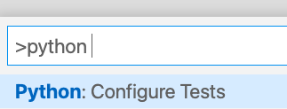
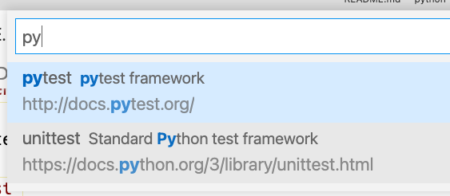
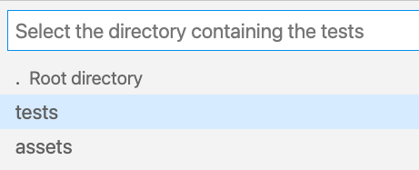
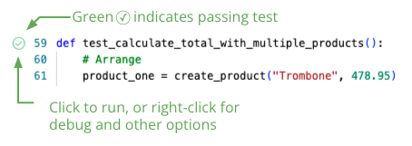

# Debugging Tests With Pytest

<iframe src="https://adaacademy.hosted.panopto.com/Panopto/Pages/Embed.aspx?pid=590635be-3cc1-42e9-8cd5-ace200631c4c&autoplay=false&offerviewer=true&showtitle=true&showbrand=false&start=0&interactivity=all" height="405" width="720" style="border: 1px solid #464646;" allowfullscreen allow="autoplay"></iframe>

All the previous learnings on debugging apply to running and debugging code when running unit tests. However, VS Code has the ability to run individual tests from the editor and it allows you to run tests in the debugger.  This can help us identify why tests fail and get them to pass.

## Goals

We have practiced using a debugger tool while running Python programs. Our goal is to apply those same debugger skills when we are running unit tests.

This lesson is structured like a follow-along exercise to illustrate:

- Setting up Pytest for the VS Code debugger
- Running tests using the VS Code debugger

Besides setup, overall we should observe that our familiar tools of setting breakpoints, running, pausing, and debugging, are overall similar between tests and programs.

## Sample Project

Clone the [Python-FizzBuzz](https://github.com/adagold/python-fizzbuzz) project and follow instructions on the README to get it to run.  There is one test failing.  In this lesson we will set up VS Code to use the debugger.

## Setting Up Pytest for VS Code Debugger

You can set up VS Code to run the tests in the editor with `command-shift-p` and enter `Python: Configure Tests`.  

  
*Fig. Telling VS Code you want to configure tests with Python.*

VS Code will ask you which test framework you want to use.  Select Pytest.  VS Code might ask you to install Pytest, which you can do so.

  
*Fig. Telling VS code which test framework you use (Pytest).*

Then select the folder containing your tests.

  
*Fig. Selecting the tests directory*

Then VS code will provide feedback on your tests allowing you to run them in the editor individually or run a test in the debugger with a click.

## Running Tests In The Debugger

Once configured VS Code can run tests in the debugger using links above each test.

The image below is an example of a test in VS code which is failing.
  
*Fig. An example of a failing test in VS Code, indicated by a red circled X beside the test name.*

While the image below shows another test which passes.
  
*Fig. An example of a passing test in VS Code, indicated by a green circled check beside the test name.*

You can then add breakpoints and use watches to examine why the test is not passing. After setting up your breakpoints, right-click the passing or failing status icon for the option to `Debug Test`.

## Summary

In this lesson we used VS Code to run the python debugger to identify bugs in tests.  This allows us to identify where and why our tests are failing.  
