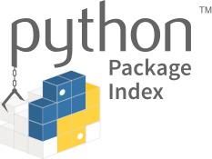

# Packages and Managing Packages

<iframe src="https://adaacademy.hosted.panopto.com/Panopto/Pages/Embed.aspx?pid=20425c72-d6f8-417b-969a-acd2000c74bd&autoplay=false&offerviewer=true&showtitle=true&showbrand=false&start=0&interactivity=all" height="405" width="720" style="border: 1px solid #464646;" allowfullscreen allow="autoplay"></iframe>

## Learning Goals

- Define package in Python
- Explain that pip is a package installer for Python

## Introduction

A popular developer-ism is "Don't reinvent the wheel."

In the collective wisdom of a developer community, while we code, sometimes we may think, "someone else has probably solved this problem."

Is there a way for us to find other coding projects to help solve our problems?

## Vocabulary and Synonyms

| Vocab   | Definition                                                                                              | Synonyms                                                         | How to Use in a Sentence                                                                                                                                                          |
| ------- | ------------------------------------------------------------------------------------------------------- | ---------------------------------------------------------------- | --------------------------------------------------------------------------------------------------------------------------------------------------------------------------------- |
| Package | A package is a collection of Python modules that are related to each other                              | "library" or "dependency" in other languages can feel equivalent | "I need to install that package on my computer before I can use it," "My project requires the `pytest` package v6.1," "Maybe there's a package for formatting tables that exists" |
| Version | A state of software, with its code and dependencies at a specific time. Usually identified with numbers | -                                                                | "There weren't a lot of changes between this version and the last version," "Package A is going to stop supporting Package B older than version 2."                               |
| Release | A distribution of a new version of a package                                                            | -                                                                |

## Packages Are Software People Can Use

In Python, a package is a collection of Python code that are related to each other.

Often, packages are meant to define code that can be utilitized as tools. Packages are used to extend a developer's abilities-- we can find, install, and use packages to help our own project development go smoother.

Packages can:

- provide functionality
- provide design patterns

Popular Python packages include:

1. NumPy, a package that gives functionality for complex math, including algebraic formulas
1. Requests, a package that makes creating HTTP Requests more readable
1. Pandas, a package designed for working with large and complex data sets and analyzing them

**Example:** Nella may be working on a project where she builds a birthday calendar, and she needs to find out how many days there are until her birthday. Nella finds that dates, times, and time zones in Python are tricky to work with. Of course, she could write all of this logic herself! Or... she could find a package that provides functionality and structure around counting down dates.

### !callout-info

## Packages and Modules

Technically, we can say a package is a collection of Python modules, and every `.py` file is a module!

### !end-callout

### Where Do Packages Come From?

  
[(source)](https://www.mrlovenstein.com/comic/906)

Packages come from people! Packages are designed, built, and maintained by other Python programmers. Some packages are built by large teams, many are built by one person.

Packages are **distributed** through a packaging index, or a center of packages. The dominant packaging index is [**The Python Package Index (PyPI)**](https://pypi.org/). PyPI is a place where programmers can find, install, and publish Python packages.

  
*Fig. The logo of the Python Package Index (PyPI, pronounced Pie-Pea-Eye). [(source)](https://pypi.org/)*  

It requires setup, but anyone can release their package to PyPI!

**Example:** If Arya wanted to make a series of Python files that could be used to generate text that compliments her, she could! She could make that package and go through the steps of making it available to PyPI. Then everyone could go and find Arya's package, install it, and use it to compliment her.

## Why Do We Need to Manage Packages?

We can install an infinite number of packages onto our computer. And with that, each package could have an infinite number of versions.

Similarly, our own computer will be different from someone else's machine. There are an infinite number of ways that the package could even be installed and found on the computer!

Over time, this can get hairy. We need to manage packages so that:

1. Our own usage of a package and its version is consistent and working
1. When we collaborate with other team members, it can be reliable that their installation is similar

There are many packages that are designed to...

- install packages
- manage packages
- allow other machines to install and manage the same packages

### Versions Have Significance

Every time a developer wants to update a package they've built and published, they _release_ a new version. Versions are named and referenced usually through versioning numbers.

There are changes in the package's logic in every version. Sometimes these changes are significant-- significant enough that developers who are using that package and depending on it may have compatibility issues.

A worst-case scenario for a developer is broken code that is failing because of a package dependency. Because that is incredibly dangerous, understanding the significance of package versions is important.

**Example:** Arya has released a Python package that calculates how many days until her birthday as version 1.0. Francesca is working on a project that calculates how many days until her half birthday, and it uses Arya's package at version 1.0. If Arya changes her package and erases all of the code, and releases it as version 1.1, what happens to Francesca's project? Francesca's project will fail if it uses version 1.1, but will be okay if it continues to use version 1.0

## Using And Managing Packages With `pip`

  
[(source)](https://github.com/topics/pip)

[`pip`](https://pypi.org/project/pip/) is a package that is a package installer. With `pip`, we will be able to install any package that is on PyPI.

We will use `pip` to install many dependencies over time.

To use `pip`, we should learn:

1. How to install it onto our own computers
1. How to list all the packages installed on our computer
1. How to install packages

### !callout-danger

## Always use pip3

In the following sections, our commands begin with `pip3`. That may be surprising; why do we use `pip3` instead of `pip`? `pip3` will specify to use `pip` with Python 3, which is not only desired, but **necessary.**

### !end-callout

<!-- Need to confirm that python3 install pip does not make this point moot -->

### Installation

Starting with Python 3.4, `pip` gets installed during the Python installation!

To verify that `pip` is installed, we can run our first `pip` command in the terminal:

```bash
pip3 --version
```

If there was output that `pip3` is not found, refer to the `pip` docs for an installation guide.

### List All Packages

To list all of the packages and their version numbers installed on our computer, we can use `pip3 list`.

### Install Packages

To install packages using pip, we use

```bash
pip3 install <packagename>
```

Where `<packagename>` is replaced with a package name.

### !callout-secondary

## Global Installations vs. Virtual Environments

The commands above are used to perform a global installations on our computer. It is best practice to use `pip` to install packages in a virtual environment.  In the next lesson we will learn how to install packages in virtual enviroments.

### !end-callout

## Summary

We will find, install, use, and manage packages in Python using `pip`.

Commands to keep handy:

- `pip3 --version`
- `pip3 list`

## Check for Understanding

<!-- Question Takeaway -->
<!-- prettier-ignore-start -->
### !challenge
* type: paragraph
* id: OP7iZa
* title: Packages and Managing Packages
##### !question

What was your biggest takeaway from this lesson? Feel free to answer in 1-2 sentences, draw a picture and describe it, or write a poem, an analogy, or a story.

##### !end-question
##### !placeholder

My biggest takeaway from this lesson is...

##### !end-placeholder
### !end-challenge
<!-- prettier-ignore-end -->
